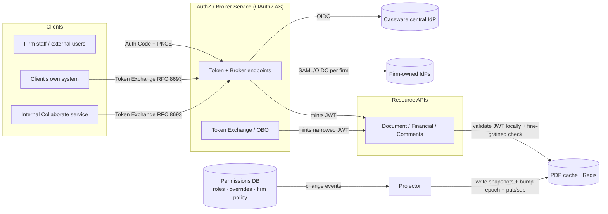

# Collaborate Authorization Layer — Design

**Scope.** The authorization layer *around* an existing identity provider: OIDC-compliant login for two
user populations, fine-grained permission checks at real-time collaborative scale, and on-behalf-of (OBO)
delegation without a confused-deputy problem. We do **not** build the IdP (credentials/MFA); we treat
Caseware's central IdP and firms' own SAML/OIDC IdPs as upstream dependencies.

**One idea underneath everything.** *Coarse, slow-changing* authorization travels **in the token** and is
verified locally with no network hop; *fine-grained, fast-changing* authorization lives in a **Policy
Decision Point (PDP) cache** fed by database change events. Tokens stay small and verifiable offline;
revocation stays fast; the database is never on the hot path. Every decision below falls out of that split.

---

## 1. High-Level Architecture



**Components**

- **AuthZ / Broker Service** — an OAuth2 Authorization Server that (a) brokers upstream IdPs (OIDC to the
  central IdP; per-firm SAML/OIDC connectors selected by client config) and mints Collaborate access +
  refresh tokens, and (b) hosts the **token-exchange / OBO** endpoint (implemented in Part 2).
- **PDP cache (Redis)** — per-user/per-workspace permission snapshots and a revocation epoch. Resource
  APIs read it; they never touch the permissions DB directly.
- **Resource APIs** — Document, Financial Data, Comments. Each validates the JWT locally (signature via
  cached JWKS, `iss`, `aud`, `exp`, `scope`) and consults the PDP only for the fine-grained slice
  (resource-level overrides, current epoch).
- **Permissions DB + Projector** — the source of truth. Any role/override/policy change emits an event
  (the assignment says we may add such hooks); the projector writes the updated snapshot to Redis, bumps
  the affected principal's epoch, and publishes a revocation message.

**Token model (the two tiers)**

| Tier | Lives in | Examples | Why |
|---|---|---|---|
| Coarse | JWT claims | `firm`, `workspace`, workspace `role`, broad `scope`, `auth_version` | Verified offline → tens of thousands of checks/sec with no DB hop |
| Fine-grained | PDP (Redis) | single-document share, per-resource override, current epoch | Changes constantly; can't fit or safely cache in a token |

**Login (Auth Code + PKCE).** The broker pattern. Per-firm client configuration selects the upstream
connector: firm staff → central Caseware IdP; external users of a federating firm → that firm's SAML/OIDC
IdP, scoped to their users/workspaces. After upstream authentication Collaborate issues **its own** short-
lived access token (~5 min) + refresh token, so downstream services trust exactly one issuer regardless of
which IdP authenticated the human.

**Fast permission checks + revocation in seconds (without mass re-auth).** Three mechanisms compose:

1. **Short access-token TTL (~5 min)** bounds the worst case and is the floor guarantee.
2. **Revocation epoch (`auth_version`).** Each principal has an integer epoch in Redis, embedded in every
   token. Any permission/membership change bumps it. Resource APIs (and the gateway) compare the token's
   `auth_version` to the current epoch (an O(1) Redis read, already on their PDP path); a mismatch → 401,
   which triggers a silent refresh. Refresh re-derives permissions and *fails closed* if membership was
   removed. This turns "revoke" into "advance a counter" — effective on the next request.
3. **Push for long-lived connections.** A collaborative editing session (WebSocket) can outlive a token
   refresh cycle. The projector publishes revocations on a **Redis pub/sub** channel; the connection layer
   subscribes and re-evaluates or drops affected sessions immediately, rather than waiting for the next
   request. TTL is the backstop; pub/sub is the fast path.

## 2. On-Behalf-Of (the confused-deputy problem)

Two delegation scenarios, one mechanism: **RFC 8693 Token Exchange**. A caller presents the end user's
identity (`subject_token`) and its own identity (`actor_token`) and receives a **narrower** token to call
**one** downstream **as** that user.

```mermaid
sequenceDiagram
  participant Client as Actor (client system / internal service)
  participant AS as AuthZ Service (/oauth2/token)
  participant PDP as PDP (Redis)
  participant DS as Downstream (e.g. Document Service)

  Client->>AS: token-exchange(subject_token=user, actor_token=self, audience=DocumentService, scope=doc.read)
  AS->>AS: validate both tokens (sig/iss/exp)
  AS->>PDP: subject permissions + current epoch
  AS->>AS: actor registered? same firm? audience known?
  AS->>AS: granted = requested ∩ subject ∩ actor ∩ audience
  AS-->>Client: access_token{ sub=user, act.sub=actor, aud=DocumentService, scope=doc.read }
  Client->>DS: call with narrowed token
  DS->>DS: validate JWT locally; check act-chain + epoch
```

**How the confused-deputy problem is defeated** — the deputy can never be tricked into exceeding authority:

- **Mandatory audience.** We *require* `audience` (RFC leaves it optional) and bind the token to exactly
  one downstream, so it can't be replayed against another service. This is the primary guard.
- **Downscope to an intersection.** The granted scope is `requested ∩ subject-permissions ∩
  actor's-registered-grant ∩ audience's-allowed-scopes`. Requested scope is never trusted on its own; the
  actor can't exceed *either* its own registration *or* the subject's real permissions (read from the PDP,
  the source of truth — not from claims the caller supplied).
- **Actor scoped to firm.** A client system may only act for users in its own firm; cross-firm delegation
  is rejected before any token is minted.
- **Attribution.** The minted token carries the RFC 8693 **`act`** claim (`act.sub` = the acting party),
  so the downstream call is auditable as "actor X acting as user U" — scenario (b)'s requirement that
  internal calls stay attributable.

Scenario (a) *client system → Collaborate as its employee* and (b) *internal service → downstream as the
triggering user* are the same exchange with different actors. Revocation for these long-lived flows uses
the **same epoch**: minted tokens are short-lived and carry `auth_version`, so a bump invalidates them on
the next hop without re-authenticating anyone.

## 3. Implementation Plan (phased)

1. **Broker + issuance** on the central IdP; JWT access/refresh tokens; JWKS publication + rotation.
2. **PDP + Redis + projector**: DB change events → snapshots, epoch, pub/sub. Wire `auth_version` revocation.
3. **Resource-API authorization**: shared middleware / ASP.NET Core policies for scope + fine-grained checks.
4. **Per-firm federation**: SAML/OIDC connectors, per-firm client config.
5. **OBO token exchange** (built in Part 2) for both delegation scenarios.
6. **Load + hardening**: soak the PDP path, chaos-test Redis/IdP outages, pen-test the exchange.

**AWS mapping:** ALB/API Gateway → ECS/EKS services; **ElastiCache (Redis)** for the PDP + pub/sub;
**KMS** (or ACM PCA) for signing keys with rotation; **EventBridge**/outbox for DB change events;
CloudWatch/OpenTelemetry for metrics and traces.

## 4. Testing Strategy

- **Unit** — scope downscoping (intersection math), actor-trust, epoch comparison.
- **Integration** — token exchange end-to-end over the real pipeline (built in Part 2 via
  `WebApplicationFactory`), including cryptographic validation of the minted token.
- **Contract** — each downstream's expected scopes/claims are pinned so a scope rename can't silently break authz.
- **Security** — the confused-deputy matrix: missing/unknown audience, scope escalation, cross-firm actor,
  forged/expired subject token, replayed token at the wrong audience.
- **Revocation latency** — bump epoch → assert the next check denies; measure event→deny time.
- **Load** — sustained PDP reads at target RPS; assert p99 decision latency and cache hit rate hold.

## 5. Evaluation & Observability

- **Metrics** — authz decision p50/p99; PDP cache hit rate; **revocation propagation time** (event→deny);
  token-exchange rate and **denial reasons broken down by OAuth error code**; refresh rate; JWKS fetch errors.
- **Audit** — structured log of every exchange: `sub`, `act.sub`, `aud`, granted `scope`, `firm`, decision.
  The actor chain is the audit record for OBO.
- **Tracing** — one trace spanning exchange → downstream call, so a denial is attributable to a specific rule.
- **SLOs** — e.g. p99 cached decision < 5 ms; revocation visible < 5 s; exchange availability ≥ 99.9%.

## 6. Failure Modes & Tradeoffs

- **Redis (PDP) outage.** Fine-grained *overrides* fail **closed** (deny) — losing the source of truth for a
  narrowing decision must not widen access. The **epoch** read may fail **open** for a short, alarmed grace
  window so a Redis blip doesn't 401 every live session; the short token TTL bounds the exposure. This
  asymmetry is deliberate and is the main safety/availability tradeoff.
- **IdP outage.** JWKS is cached, so *validation* survives; only *new logins* degrade.
- **TTL vs revocation latency.** Shorter TTL = faster natural revocation but more refresh load. We pick
  ~5 min TTL + epoch + pub/sub so we get fast revocation *without* paying for very short TTLs everywhere.
- **Cache staleness vs consistency.** Event-driven invalidation is the normal path; the epoch is the
  backstop that makes a missed event *fail safe* (stale token is rejected) rather than *fail open*.
- **Downscoping complexity.** Always computing an intersection is more code than honoring requested scope,
  but it's the only version that's safe under a confused-deputy attack — worth it.
- **JWKS rotation & clock skew.** Overlapping keys during rotation; small (±30 s) skew allowance on `exp`/`nbf`.

---

*Part 2 implements the OBO token-exchange slice (Section 2) as a runnable ASP.NET Core service with tests.
See `README.md`.*
